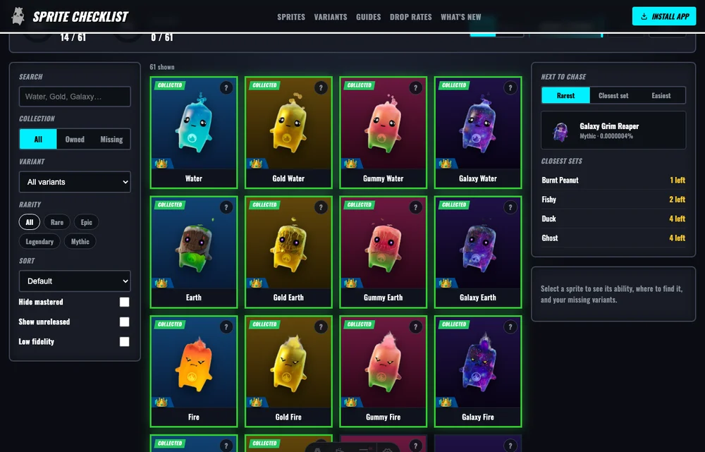
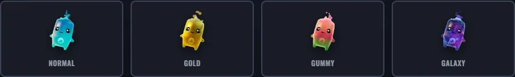

# Fortnite Sprites: The Complete Collector's Guide (Chapter 7 Season 3)

Fortnite Chapter 7 Season 3, "Runners," put a brand-new collectible front and center: **Sprites**. These little companion creatures are equal parts gameplay tool and collection challenge, and finishing the set has quietly become one of the season's most addictive side quests. This guide covers everything you need to know — what Sprites are, how to get and keep them, how variants and rarities work, and how to track the whole thing without losing your mind. If you just want the fastest way to see what you're missing, a free [fortnite sprite checklist](https://spritechecklist.org) does the heavy lifting for you.

## What Are Fortnite Sprites?

Sprites are collectible companion creatures you find during a match. Each one carries a passive ability that works while it's equipped — replenishing shields, improving your loot, boosting XP, or giving you a combat edge. That makes them genuinely useful in a fight, not just cosmetic. But they're also a true collectible: once you permanently unlock a Sprite, it joins your collection and you can summon it again in future matches.

There are roughly a dozen and a half base Sprites in the current season, spread across four rarity tiers, and Epic keeps adding more on a near-weekly cadence. Counting every variant, the full set is much larger than the base creature count suggests, which is exactly why collectors treat it as a season-long goal.

## How to Get and Extract Sprites

Finding a Sprite is only half the job. Here's the loop:

1. **Find one.** Sprites drop primarily from **Sprite Chests**, each of which is guaranteed to contain one. You can also find them at lower odds in regular chests, Rare Chests, supply drops, and from defeated players who were carrying one. Vaults are a strong source too.
2. **Extract it.** This is the part that trips up newcomers. To keep a Sprite permanently, you must carry it to an **Extraction Site** (marked by a beam of light) or use a **Portable Extractor**, then complete the extraction before the match ends.
3. **Don't die first.** If you go down before extracting, the Sprite is gone. That permadeath risk is what makes targeted "chases" for specific missing Sprites so tense — and so satisfying when they pay off.

Once a Sprite is extracted, it's yours for good and can be re-summoned in later matches.

## Sprite Rarities

Every Sprite sits in one of four rarity tiers, and higher rarity generally means a stronger passive.

- **Rare** — the common, beginner-friendly tier (Water, Earth, Fire, Fishy).
- **Epic** — stronger effects (Duck, Ghost, Demon, King, Aura, Striker).
- **Legendary** — high-impact abilities (Dream, Punk, Boss).
- **Mythic** — the best and rarest (Zero Point, Burnt Peanut, Grim Reaper).

Drop rates scale steeply with rarity. A Rare Sprite shows up far more often than a Mythic one, and the rarest variants can dip into fractions-of-a-percent territory.

## Sprite Variants

Variants are what turn a short list of creatures into a real collection. Most Sprites come in several themed finishes, each with its own gameplay bonus.

- **Normal** — the base version with the standard ability.
- **Gold** — bonus Sprite XP from eliminations, ideal for leveling fast.
- **Gummy** — extra Sprite Dust on extraction, best for farming currency.
- **Galaxy** — more ammo on pickup, great for aggressive play (and the flashiest to show off).
- **Gem / Holofoil / Rift** — newer special variants that roll out gradually.

Because the variant lineup keeps expanding, "I have Water" is never the same as "Water is complete." Each variant is its own unlock, so the real target is every creature in every released finish.

## Sprite Dust and Summoning

When you extract a Sprite, you also earn **Sprite Dust**, the season's currency. Instead of hunting for a specific Sprite every match, you can spend Dust to summon one you already own right at the start of a run. The Gummy variant is the best Dust farmer thanks to its extraction bonus, and weekend events can stack extra Dust on top.

## Mastering Sprites

Beyond collecting, there's **mastery**. Each owned Sprite earns Sprite XP as you use it, and reaching the max level (then extracting at that level) marks it as Mastered. Mastering many Sprites unlocks milestone rewards. This is why serious collectors track two separate goals: collection percentage *and* mastery percentage. Weekly events like Mastery Mondays accelerate leveling and Dust gains, so they're the smart days to grind.

## How to Track Your Collection

With dozens of Sprite-and-variant combinations — and new ones dropping most Thursdays — it gets genuinely hard to remember which Gold, Gummy, or Galaxy versions you still need. A note app can store names, but it can't show real icons, separate collection from mastery, surface your rarest missing Sprite, or generate a shareable image of your progress.

That's where a dedicated tracker helps. The [fortnite sprite checklist](https://spritechecklist.org) keeps every Sprite and variant in one grid, saves your progress in your browser with no sign-in, shows two progress rings for collection and mastery, and tells you exactly what to chase next — the rarest missing Sprite, the closest set to finishing, or the easiest pull. You can also copy a share link, export a collection image for Discord or Reddit, and back up your progress with a code.

## Tips for Completing Your Collection

- **Land near vaults and Sprite Chests** so you can start collecting before the lobby spreads out.
- **Always have an extraction plan** — losing a stack of un-banked Sprites to a third party hurts more than any weapon loss.
- **Prioritize Gummy and Gold variants** when you spot them; the bonus Dust and XP compound over the season.
- **Chase rare variants on event days**, when boosted spawns and double Dust make the grind faster.
- **Check your missing list before each session** so every run has a clear target instead of aimless looting.

Sprites are a time-limited season mechanic, so the collection is a moving, expanding goal with a real deadline. Whether you're going for 100% or just want a clean record of what you own, staying organized is the difference between finishing the set and running out of time. Bookmark a good tracker, mark off each Sprite as you extract it, and let the tool handle the bookkeeping while you focus on the hunt.

---

*Fortnite and Sprites are trademarks of Epic Games, Inc. This is an unofficial fan guide and is not affiliated with or endorsed by Epic Games.*
